# JIT Re-Rank

A Manifest V3 browser extension that **learns your taste on-device and silently re-ranks lists of content in place** — no page reload, no data leaving your machine by default. It re-orders the items already on the page (videos, papers, models, posts) so the ones you're most likely to want float to the top.

<p align="center">
  
</p>

> **Status:** research prototype. Inspired by *just-in-time information recommendation* (see [Attribution](#attribution)). Not an official product; see [License & IP](#license--ip).

> **The name — Kairosrank.** It joins *kairos* (καιρός — the ancient Greek word for the *opportune moment* to act, as distinct from *chronos*, mere clock time) with *rank*, capturing the system's central bet: inferring the right moment to silently re-rank the page on-device.

---

## What it does

- **Silent, on-device re-rank** — a bundled multilingual embedding model learns a per-site preference vector from what you open, search, and dwell on, then re-orders the list by similarity. Runs entirely locally; nothing is sent anywhere.
- **🙈 Hide seen** — hide items you've already opened, so a listing shows only what's new to you.
- **≈ More like this** — ⌥/Alt-click any item to instantly re-rank the whole list by similarity to that one item (no profile change).
- **Ask-me re-rank (optional, cloud)** — a bring-your-own-key path where an LLM asks you 1–2 multiple-choice questions and re-scores the list. **Off by default.**
- **Knows when to interrupt** — a tiny online model decides *when* to act from your browsing journey, so it stays a quiet pill until it's useful.

### Supported sites
**arXiv** · **Hugging Face** (models / datasets / papers) · **Hacker News** · **Papers with Code** (`paperswithcode.co`) · **iyf.tv** (video).

---

## Components included

| Area | Path | What it is |
|---|---|---|
| **Content script** | `entrypoints/content.ts` | Injected on supported sites; boots the orchestrator + UI panel. |
| **Orchestrator** | `src/rerank/flow.ts` | The core loop: detect cards → track journey → re-rank (silent / LLM) → in-place reorder. |
| **UI panel** | `src/rerank/panel.ts` | Shadow-DOM pill + panel (question UI, toggles, ranked list). |
| **In-place reorder** | `src/rerank/reorder.ts` | Moves real DOM nodes by score (preserves listeners/hover); group-aware for multi-element units (arXiv `dt`+`dd`, HN rows); reversible hide. |
| **Site adapters** | `src/sites/*.ts` | Per-site selectors for cards/title/tags/id (5 sites) + `collectCards()`. |
| **On-device embedder** | `entrypoints/offscreen/` + `src/embed/embedder.ts` | Runs the embedding model via transformers.js + ONNX Runtime (WASM) in an MV3 offscreen document. |
| **Preference model** | `src/embed/profile.ts`, `vec.ts` | Per-site preference **centroid** + cosine ranking. |
| **When-to-interact model** | `src/rerank/policy.ts`, `features.ts`, `monitor.ts` | Online logistic model over 16 journey features; decides when to act. |
| **Memory / journey** | `src/rerank/memory.ts`, `interactionLog.ts`, `session.ts` | Per-site opened-items, watch time, and interaction timeline (local). |
| **Background worker** | `entrypoints/background.ts` | MV3 service worker; routes embed + LLM requests, manages the offscreen doc. |
| **LLM providers** | `src/llm/{anthropic,openai,format,prompts,mock}.ts` | Provider-abstracted question-gen/scoring (Anthropic + OpenAI), shared prompts, offline mock. |
| **Options page** | `entrypoints/options/` | Dev mode, provider, API keys, model selection. |
| **Bundled model** | `public/models/…MiniLM-L12-v2/` | `paraphrase-multilingual-MiniLM-L12-v2` (384-dim, 50+ languages), ~143 MB. |
| **Bundled runtime** | `public/ort/` | ONNX Runtime Web WASM binaries. |

**Stack:** [WXT](https://wxt.dev) · TypeScript · [Transformers.js](https://github.com/huggingface/transformers.js) · ONNX Runtime Web · Vitest + Playwright.

---

## Install & run (load unpacked)

Requires **Node 20** (see `.nvmrc`).

```bash
nvm use            # Node 20
npm install
npm run fetch-assets   # download the embedding model + ONNX runtime into public/ (~180 MB)
npm run build          # → dist/chrome-mv3
```

> The bundled model (`paraphrase-multilingual-MiniLM-L12-v2`, ~143 MB) and the ONNX Runtime Web WASM (~35 MB) are **not committed to git** (the model alone exceeds GitHub's 100 MB file limit). `npm run fetch-assets` downloads the model from Hugging Face and copies the runtime from `node_modules`, populating `public/models/` and `public/ort/`. It's idempotent — safe to re-run.

Then in Chrome: **`chrome://extensions`** → enable **Developer mode** → **Load unpacked** → select **`dist/chrome-mv3`**.

Open any [supported site](#supported-sites); a small **re-rank pill** appears top-right.

For live development with hot-reload: `npm run dev`.

---

## Usage

- **It works automatically.** As you browse, it learns your taste and silently re-orders lists once it's confident. The pill shows the current state.
- **Manual re-rank / questions:** click the pill. With **Dev mode on** (default) you get mock questions; with a cloud key set, you get real LLM-generated questions, then the list re-ranks.
- **🙈 Hide seen:** toggle in the panel — hides items you've already opened on this site.
- **≈ More like this:** hold **⌥/Alt** and click any item to rank the list by similarity to it.
- **Undo / Forget:** Undo reverts the last re-rank; Forget clears this site's learned profile + memory.

---

## Configuration (Options page)

`chrome://extensions` → JIT Re-Rank → **Details → Extension options**:

- **Dev mode** *(default ON)* — uses mock LLM responses; **no network calls**. Turn off to use a real provider.
- **Provider** — Anthropic (Claude) or OpenAI (ChatGPT).
- **API key** — per provider; stored only in `chrome.storage.local`, sent only to that provider's API.
- **Model** — smallest/cheapest by default (Claude Haiku / `gpt-4o-mini`).

---

## Development

```bash
npm test        # unit tests (Vitest + happy-dom)
npm run compile # type-check (wxt prepare && tsc --noEmit)
npm run build   # production build → dist/chrome-mv3
npm run zip     # packaged .zip
```

End-to-end / model scripts live in `scripts/` (Playwright-driven, headless Chromium with the extension loaded) — e.g. `node scripts/silent-e2e.mjs` (on-device re-rank), `scripts/research-e2e.mjs` (arXiv/HN adapters), `scripts/research-func-e2e.mjs` (hide-seen + more-like-this), `scripts/error-scan.mjs` (boot/error sweep).

---

## Privacy

- **On-device by default.** The everyday re-rank, hide-seen, and more-like-this run entirely locally — the embedding model is bundled and never fetched. **No browsing data leaves your machine** unless you opt into the cloud LLM path.
- **Cloud path is opt-in and BYO-key.** Only when you disable Dev mode and add your own key are item titles + your interaction summary sent to your chosen provider (Anthropic or OpenAI) to generate a question and scores.
- No analytics or telemetry. Per-site memory is stored locally and can be wiped with **Forget**.

> Note: the video sites include adult content; the interaction/preference data for those sites is sensitive. A per-site guardrail for the cloud path is planned but not yet wired — keep Dev mode on (or unset keys) on those sites if this matters to you.

---

## Attribution

The project's concept — *just-in-time information recommendation* — is adapted (concept only; no code or data) from:

> Ke Yang, Kevin Ros, Shankar Kumar Senthil Kumar, ChengXiang Zhai. *JIR-Arena: The First Benchmark Dataset for Just-in-time Information Recommendation.* arXiv:2505.13550, 2025.

Third-party software and models are credited in **[`NOTICE`](NOTICE)** and **[`THIRD_PARTY_NOTICES.md`](THIRD_PARTY_NOTICES.md)**.

---

## License & IP

Research prototype. **A project license is not yet applied** — see `NOTICE`. Bundled/third-party components are permissively licensed (Apache-2.0 / MIT); details in `THIRD_PARTY_NOTICES.md`.
